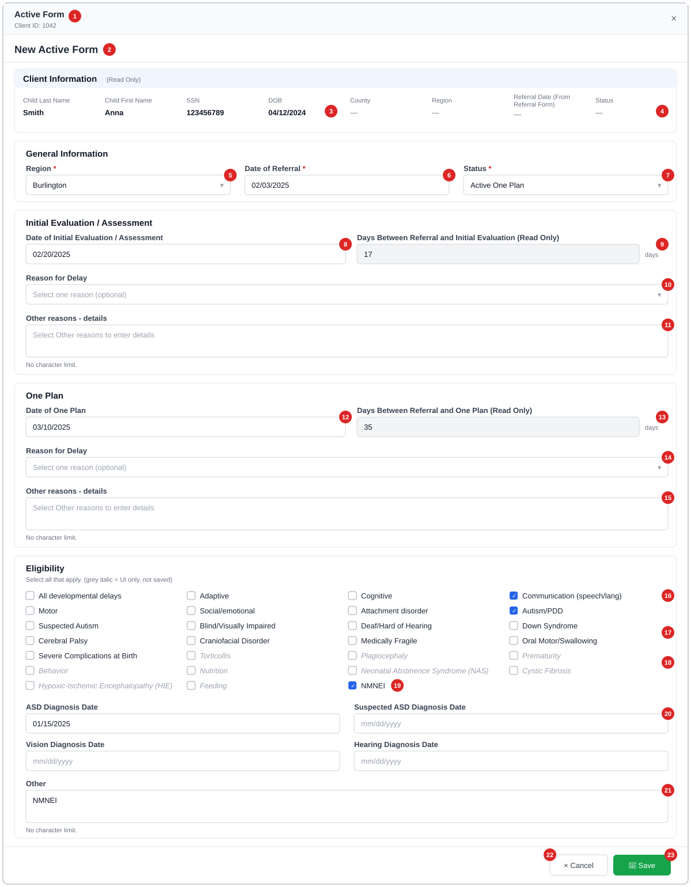

# 00 — Annotated Wireframe: Active Form

Wireframe of the Active Form as built today. It opens as a full-screen modal from the Client screen → **Input Forms** tab → **Active** (new) or **View/Edit** on an Active row (edit). Numbered red markers match the table below. Sample data is fictional.

Rules referenced as `BR-AF-…` / `AF-GAP-…` are in [03-business-rules.md](03-business-rules.md); fields are specified in [06-field-spec.md](06-field-spec.md).

*Grey italic conditions are on screen but **not saved** (AF-GAP-02).*

---

## Header and Client Information

| # | Element | Type | Behaviour | Data | Rules |
| - | ------- | ---- | --------- | ---- | ----- |
| 1 | Modal header | Title, Client ID, × | × closes without saving. | `ChildID` | BR-AF-01, 06 |
| 2 | Page heading | Text | "New Active Form" or "Edit Active Form". | mode | BR-AF-05 |
| 3 | Client details | Read-only labels | Child Last Name, First Name, SSN (unmasked), DOB (MM/DD/YYYY). | `stblPeople` | AF-GAP-17 |
| 4 | County, Region, Referral Date (From Referral Form), Status | Read-only labels | **Always "—"**; the page never supplies them. | — | AF-GAP-07 |

## General Information

| # | Element | Type | Behaviour | Data | Rules |
| - | ------- | ---- | --------- | ---- | ----- |
| 5 | Region * | Dropdown | Active regions; defaults to the client's region. "Region is required." | `Region` | BR-AF-20, 21 |
| 6 | Date of Referral * | Date | Required; not before DOB. Free entry: legacy reports need it to equal the Referral form's date. | `ReferralDate` | BR-AF-22, 23, AF-GAP-05 |
| 7 | Status * | Dropdown | Active One Plan / Active One Plan – CAPTA → saved as `aop` / `aop-capta`. | `FormType` | BR-AF-12, 13, AF-GAP-03 |

## Initial Evaluation / Assessment

| # | Element | Type | Behaviour | Data | Rules |
| - | ------- | ---- | --------- | ---- | ----- |
| 8 | Date of Initial Evaluation / Assessment | Date | Required by validation (no `*` shown); can't be before Referral Date or DOB. | `InitialEvalDate` | BR-AF-30, 31, AF-GAP-15 |
| 9 | Days Between Referral and Initial Evaluation | Read-only number | Calculated; not saved. 45-day compliance isn't stored. | — | BR-AF-32, 33, AF-GAP-04 |
| 10 | Reason for Delay | Dropdown, 2 groups | Optional. "1. Due to family and/or child circumstances" (+ "Auto Eligible") or "2. NOT due to … (non-compliant)". | `DelayFC` / `DelayNotFC` | BR-AF-50..52 |
| 11 | Other reasons – details | Text area | **Not saved.** | (should be `DelayFCOther` / `DelayNotFCOther`) | BR-AF-53, AF-GAP-01 |

## One Plan

| # | Element | Type | Behaviour | Data | Rules |
| - | ------- | ---- | --------- | ---- | ----- |
| 12 | Date of One Plan | Date | Required by validation; can't be before Referral Date or DOB. | `InitialMeetingDate` | BR-AF-40, 41 |
| 13 | Days Between Referral and One Plan | Read-only number | Calculated; not saved. | — | BR-AF-42, 44 |
| 14 | Reason for Delay | Dropdown, 2 groups | Optional (no "Auto Eligible" here). | `MeetingDelayFC` / `MeetingDelayNC` | BR-AF-50, 51 |
| 15 | Other reasons – details | Text area | **Not saved.** | (should be `MeetingDelayFCOther` / `MeetingDelayNCOther`) | AF-GAP-01 |

## Eligibility

| # | Element | Type | Behaviour | Data | Rules |
| - | ------- | ---- | --------- | ---- | ----- |
| 16 | Developmental delays | Checkboxes ×6 | All, Adaptive, Cognitive, Communication, Motor, Social/emotional. | `DDAll` … `DDSocial` | BR-AF-61 |
| 17 | Diagnosed conditions | Checkboxes ×11 | Attachment … Severe Complications at Birth. | `DCAttachment` … `DCBirth` | BR-AF-62 |
| 18 | UI-only conditions | Checkboxes ×9 | Torticollis, Plagiocephaly, Prematurity, Behavior, Nutrition, NAS, Cystic Fibrosis, HIE, Feeding — **not saved**. | none | BR-AF-63, AF-GAP-02 |
| 19 | NMNEI | Checkbox | Ticking adds a line "NMNEI" to **Other**; unticking removes it. | inside `DCOtherDesc` | BR-AF-64, AF-GAP-10 |
| 20 | Diagnosis dates | Dates ×4 | ASD, Suspected ASD, Vision, Hearing; always editable; not before DOB. | `AutismDate`, `SuspectedDate`, `BlindDate`, `DeafDate` | BR-AF-65 |
| 21 | Other | Text area | Free text (+ NMNEI line). Hint says "No character limit", but the DB allows 255. | `DCOtherDesc` | BR-AF-66, AF-GAP-12 |

## Actions

| # | Element | Behaviour | Messages |
| - | ------- | --------- | -------- |
| 22 | Cancel | Closes without saving. | — |
| 23 | Save | Validates, then creates or updates; the Input Forms grid refreshes and the modal closes. Shows "Saving..." while busy. | "Active Form saved successfully." / "Active Form updated successfully." / server message or "Failed to save Active Form." |

**Other screen states:** "Loading Active Form..." · "Client information could not be loaded." · "Active Form record not found." (edit, then closes).
