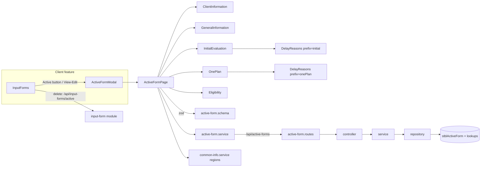

# 01 — Code Annotations: Active Form

File-by-file walkthrough of the Active Form feature. Line references are to the working tree on 2026-10-01. That tree includes uncommitted changes: `GeneralInformation.tsx` (region type import) and the removal of `/lookups/regions` from the controller and routes.

---

## 1. Architecture

The form uses **react-hook-form** with a **zod** resolver; all sections share one form context (`FormProvider`).

---

## 2. Backend — `backend/src/modules/active-form`

| File | Annotation |
| ---- | ---------- |
| [index.ts](../../backend/src/modules/active-form/index.ts) | Exports the router as `activeFormRoutes` (mounted at `/api/active-forms` in [app.ts:58](../../backend/src/app.ts#L58), no auth) and the types. |
| [active-form.routes.ts](../../backend/src/modules/active-form/active-form.routes.ts) | 4 lookup routes first ("must come before /:childId"), then `GET/POST /:childId` and `GET/PUT/DELETE /:childId/:id`. No `@swagger` comments. |
| [active-form.controller.ts](../../backend/src/modules/active-form/active-form.controller.ts) | One-line adapters. `create` returns **201**. `towns` passes `search` only when it's a string. |
| [active-form.types.ts](../../backend/src/modules/active-form/active-form.types.ts) | `ActiveFormRecord` is an untyped `Record<string, unknown>`. `ActiveFormClient.Region` is typed `string` (the DB column is `int`). `ActiveFormWithClient` is unused. |
| [active-form.config.ts](../../backend/src/modules/active-form/active-form.config.ts) | `ACTIVE_FORM_TABLE`, the **write whitelist** `WRITABLE_COLUMNS` (65 columns) and the lookup table names. Comment documents the aliases `status → FormType`, `onePlanDate → InitialMeetingDate`. |

### 2.1 [active-form.service.ts](../../backend/src/modules/active-form/active-form.service.ts)

| Function | Annotation |
| -------- | ---------- |
| `error(message, status)` | Throws an `Error` tagged with a status (400 default). The global error middleware ignores the tag and returns 500. |
| `int(value, name)` | Positive-integer check for `ChildID` / `ID`. |
| `date(value, field)` | Empty → null; else must be `YYYY-MM-DD` and a real calendar date (round-trip check). |
| `aliases(raw)` | Copies `status` → `FormType` and `onePlanDate` → `InitialMeetingDate` (only if the target isn't already set), then deletes the aliases. |
| `validateDates(p, dob)` | Referral, InitialEval and OnePlan must not be before DOB. The commented-out version above it also checked eval/One Plan ≥ referral ([:36-52](../../backend/src/modules/active-form/active-form.service.ts#L36-L52)). |
| `child(childId)` | Loads the client or throws "Client not found" (404). |
| `townMapping(p)` | If `Town` is sent, resolves it by code or name and sets `Town`, `CountyCode` and `SU_id` (if not sent). |
| `get` | Returns `{ client, forms }`. |
| `create` | Rejects `Region: ""`, validates dates against DOB, maps town, inserts. |
| `update` | Requires the row to exist; validates the **merged** row (existing + changes); partial update. |
| `remove` | Deletes; "Active Form not found" if 0 rows. Returns `{ success: true }`. |
| `lookups` | Pass-through to repository lookup queries. |

### 2.2 [active-form.repository.ts](../../backend/src/modules/active-form/active-form.repository.ts)

| Function | Annotation |
| -------- | ---------- |
| `clean(payload)` | Drops `ID`, `ChildID`, `childId` and anything not in the whitelist. |
| `bind(req, key, value)` | Types parameters from the JS value: `null` → `NVarChar`, boolean → `Bit`, integer → `Int`, else `NVarChar` (so dates and numeric strings rely on SQL Server's implicit conversion). |
| `col(name)` | Brackets a column name (`[Name]`, with `]` escaped). Safe because names come from the whitelist. |
| `getClient` | `stblPeople` header for the form. |
| `findByChildId` | `SELECT *` for the client, `ORDER BY ReferralDate IS NULL, ReferralDate DESC, ID DESC`. |
| `findOne` | One row by `ChildID` + `ID`. |
| `insert` | Dynamic `INSERT (ChildID, …keys) OUTPUT INSERTED.ID`, then re-reads the row. |
| `update` | Dynamic `UPDATE SET …keys, LastUpdateDate = GETDATE()`; re-reads. Does nothing if no keys survive the whitelist. |
| `remove` | `DELETE` + `SELECT @@ROWCOUNT`. |
| `getSupervisoryUnions` / `getTowns` / `getTown` / `getServiceCoordinatorTypes` / `getDelayReasons` | Lookup queries; `getDelayReasons` runs both lists in parallel. |

---

## 3. Frontend — `frontend/src/features/active-form`

| File | Annotation |
| ---- | ---------- |
| [index.ts](../../frontend/src/features/active-form/index.ts) | Exports the page plus `ActiveFormAddPage` / `ActiveFormEditPage`, which are unused re-exports of the same page. |
| [schemas/active-form.schema.ts](../../frontend/src/features/active-form/schemas/active-form.schema.ts) | Zod schema: Region ≥ 1; Referral, Initial Evaluation and One Plan dates **required**; status required; date format checks; eval and One Plan ≥ referral. Booleans for every eligibility item, including the 9 UI-only ones. |
| [components/FormField.tsx](../../frontend/src/features/active-form/components/FormField.tsx) | `Field`: label, optional red `*`, child control, error text. |
| [components/formStyles.ts](../../frontend/src/features/active-form/components/formStyles.ts) | Shared input class (green focus ring). |

### 3.1 [pages/ActiveFormPage.tsx](../../frontend/src/features/active-form/pages/ActiveFormPage.tsx)

Props: `childId`, `formId?` (edit when set), `onClose`, `onSaved?`.

| Part | Annotation |
| ---- | ---------- |
| `toDateInput` | Cuts any date string to `YYYY-MM-DD`. |
| `toValues(form)` | DB row → form values. Delay columns become `family::x` / `provider::x`. `onePlanDate` comes from `InitialMeetingDate`. `NMNEI` is ticked if `DCOtherDesc` has a line "NMNEI". The 9 UI-only conditions read non-existent columns, so they're always false. |
| `toPayload(values, isNew)` | Form values → API body. Sets `FormDate` = today (local) on new forms. Splits the delay reasons into the FC/NotFC pair. **Omits** `DelayDetails`, `MeetingDelayDetails` and the 9 UI-only conditions. |
| `validateDates` | Second pass after zod: all 7 dates ≥ DOB; eval and One Plan ≥ referral. Shows the first failure as a toast. |
| Load effect | In parallel: `GET /api/active-forms/{childId}`, regions, delay reasons. Edit mode finds the form in `forms` by ID; new mode defaults Region to the client's region. |
| `saveForm` | DOB checks → POST or PUT → success toast → `onSaved()` (parent refreshes and closes). Errors show the server `message`. |
| Render | Loading/error states; sticky header "New/Edit Active Form"; five sections; sticky footer Cancel / Save ("Saving..."). |

### 3.2 Sections

| Component | Annotation |
| --------- | ---------- |
| [ClientInformation.tsx](../../frontend/src/features/active-form/components/ClientInformation.tsx) | Read-only header with 8 items. Optional props `county`, `regionName`, `referralDate`, `status` are never passed, so those four always show "—". SSN is unmasked. |
| [GeneralInformation.tsx](../../frontend/src/features/active-form/components/GeneralInformation.tsx) | Region select (`valueAsNumber`, "Select region" = 0), Date of Referral, Status (`aop` / `aop-capta`) ([:65-66](../../frontend/src/features/active-form/components/GeneralInformation.tsx#L65-L66)). The `register` rules are ignored because the zod resolver takes over; the zod messages are shown. |
| [InitialEvaluation.tsx](../../frontend/src/features/active-form/components/InitialEvaluation.tsx) | Evaluation date (min = later of referral and DOB); read-only day count (`dayjs.diff`); `DelayReasons prefix="initial"`. |
| [OnePlan.tsx](../../frontend/src/features/active-form/components/OnePlan.tsx) | Same pattern for `onePlanDate`; `DelayReasons prefix="onePlan"`. |
| [DelayReasons.tsx](../../frontend/src/features/active-form/components/DelayReasons.tsx) | One select with two option groups (family / provider). Values are prefixed `family::` or `provider::`. Adds "Auto Eligible" to family for the initial evaluation. The "Other reasons – details" textarea is registered to `DelayDetails`/`MeetingDelayDetails`, which aren't saved. |
| [Eligibility.tsx](../../frontend/src/features/active-form/components/Eligibility.tsx) | 26 condition checkboxes + NMNEI; 4 diagnosis dates (min = DOB); "Other" textarea. An effect keeps a line "NMNEI" in Other in sync with the NMNEI checkbox. |

### 3.3 Shared files outside the feature

| File | Annotation |
| ---- | ---------- |
| [services/active-form.service.ts](../../frontend/src/services/active-form.service.ts) | Axios wrapper for all 9 endpoints. The UI uses `get`, `create`, `update` and `delayReasons`. |
| [types/active-form.ts](../../frontend/src/types/active-form.ts) | `ActiveFormClient`, `ActiveFormRecord` (open index signature), lookup types, `ActiveFormValues`, `DEFAULT_ACTIVE_FORM_VALUES`. |
| [client/components/InputForm/InputForms.tsx](../../frontend/src/features/client/components/InputForm/InputForms.tsx) | Hosts the modal (`ActiveFormModal`); deletes Active rows via the generic input-form API. |

### 3.4 Tests

There are no tests for the Active Form feature or module. `InputForms.test.tsx` mocks `ActiveFormPage` and only checks that the modal opens and that the delete confirmation says "Active Form".
