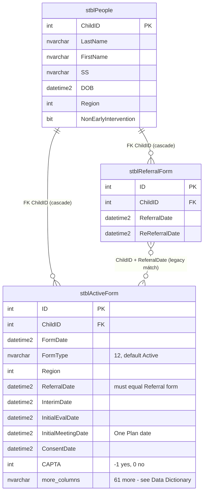
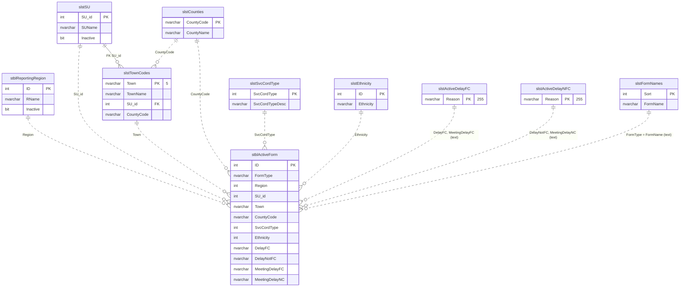

# 07 — Entity-Relationship Diagram: Active Form

Built from the `dbCDD` DDL (2026-09-09). Solid lines are **physical FKs**; dashed lines are **logical** relationships (used by queries, not enforced by the database).

`stblActiveForm` has 72 columns. The diagrams show the key and referencing columns only; see [04-data-dictionary.md](04-data-dictionary.md) for every column, grouped as: header (6), location and service coordinator (15), evaluation and One Plan (23), eligibility (23), audit (5).

---

## 1a. Core: the form, its client and its referral

## 1b. Lookups referenced by the form

Only the referencing columns of `stblActiveForm` are shown.

## 2. Relationship catalogue

| # | Parent | Child | Join | Physical FK | On delete | Notes |
| - | ------ | ----- | ---- | ----------- | --------- | ----- |
| R1 | `stblPeople` | `stblActiveForm` | `ChildID` | `stblActiveForm$stblPeoplestblActiveForm` | **Cascade** | Deleting a client deletes its Active Forms |
| R2 | `stblReportingRegion` | `stblActiveForm` | `Region = ID` | No | — | UI picks from active regions |
| R3 | `slstSU` | `stblActiveForm` | `SU_id` | No | — | `SUName` also copied onto the form |
| R4 | `slstTownCodes` | `stblActiveForm` | `Town` | No | — | Form column is `nvarchar(3)`, lookup key `nvarchar(5)` |
| R5 | `slstCounties` | `stblActiveForm` | `CountyCode` | No | — | Derivable from Town |
| R6 | `slstSvcCordType` | `stblActiveForm` | `SvcCordType` | No | — | Values 1–4 per column description |
| R7 | `slstEthnicity` | `stblActiveForm` | `Ethnicity = ID` | No | — | Not used by the new UI |
| R8 | `slstActiveDelayFC` | `stblActiveForm` | `DelayFC`, `MeetingDelayFC` = `Reason` (text) | No | — | Lookup text is 255, form columns 50 |
| R9 | `slstActiveDelayNFC` | `stblActiveForm` | `DelayNotFC`, `MeetingDelayNC` = `Reason` (text) | No | — | Same |
| R10 | `slstFormNames` | `stblActiveForm` | `FormType = FormName` (text) | No | — | `aop` values don't match |
| R11 | `slstSU` | `slstTownCodes` | `SU_id` | `slstTownCodes$slstSUslstTownCodes` | No action | Only FK among the lookups |
| R12 | `stblReferralForm` | `stblActiveForm` | `ChildID` **and** `ReferralDate` | No | — | Legacy `LoopAB` / `Base0701` match a referral to its Active Form by equal dates |

## 3. Notes for the DBA

1. The only enforced relationship is R1 (cascade). Every lookup is matched by value; text lookups (R8–R10) break silently on spelling or length differences.
2. No index on `stblActiveForm.ChildID`; the client lookup (`WHERE ChildID = …`) and the cascade delete scan the table.
3. `Town nvarchar(3)` can't hold `slstTownCodes.Town nvarchar(5)` values longer than 3 characters.
