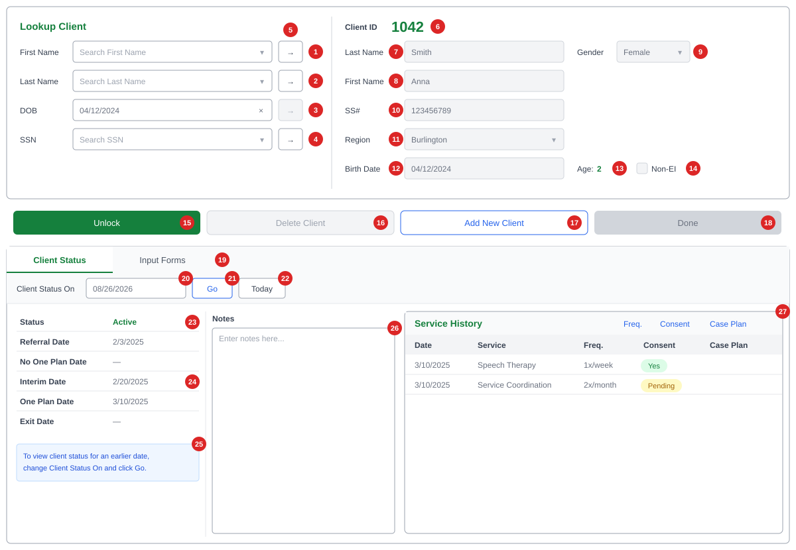
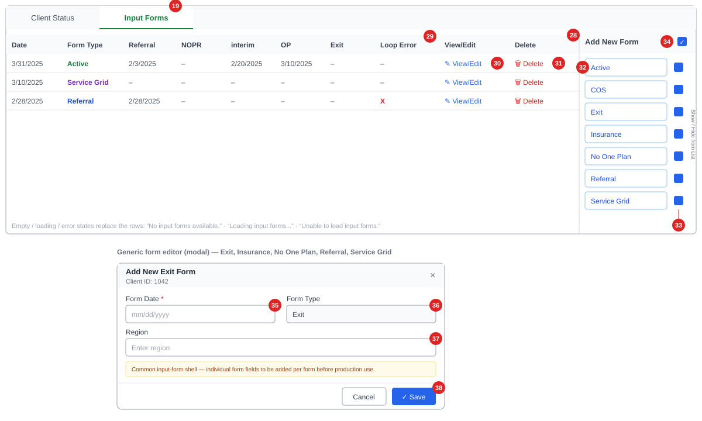

# 00 — Annotated Wireframe: Client Screen

Wireframe of the Client screen (`ClientPage`) as built today. Numbered red markers match the tables below. Sample data is fictional.

The screen has three stacked areas:

1. **Client Lookup & Details** (top) — find a client and view/edit demographics.
2. **Action bar** — Lock/Unlock, Delete, Add New, Done.
3. **Tabs** — *Client Status* (status, notes, service history) and *Input Forms* (form history and form entry).

Rules referenced as `BR-…` are in [03-business-rules.md](03-business-rules.md); fields are specified in [06-field-spec.md](06-field-spec.md).

---

## View 1 — Client Status tab

*Shown in the **locked** state (default after a client is loaded): demographic fields greyed out, Delete and Done disabled.*

### Client Lookup (left panel)

| # | Element | Type | Behaviour | Data / API | Rules |
| - | ------- | ---- | --------- | ---------- | ----- |
| 1 | First Name lookup | Searchable dropdown | Typing searches clients whose **first name starts with** the text; up to 20 results shown as "First Last". | `GET /api/clients/search/firstname` | BR-LKP-01, 03, 04 |
| 2 | Last Name lookup | Searchable dropdown | Same as 1, on last name. | `GET /api/clients/search/lastname` | BR-LKP-01, 03 |
| 3 | DOB | Date input with × clear | Shows the loaded client's DOB. The → button is always disabled (no DOB search). ⚠ Editing this box changes the client's DOB even when locked. | `stblPeople.DOB` | BR-LKP-08, BR-GAP-03 |
| 4 | SSN lookup | Searchable dropdown | Typing searches SSNs **containing** the text; results show the SSN. | `GET /api/clients/search/ssn` | BR-LKP-02 |
| 5 | → (Load) buttons | Button ×4 | Loads the selected client into the right panel and fills all three lookup boxes with that client. Disabled until a result is chosen. | `GET /api/clients/{id}` | BR-LKP-06, 07 |

### Client Details (right panel)

| # | Element | Type | Behaviour | Data | Rules |
| - | ------- | ---- | --------- | ---- | ----- |
| 6 | Client ID | Read-only label | Shows the ID, or **New** for an unsaved client. | `ChildID` | BR-ID-01, 02 |
| 7 | Last Name | Text | Required. Editable only when unlocked. | `LastName` nvarchar(50) | BR-VAL-01, 04 |
| 8 | First Name | Text | Required. Editable only when unlocked. | `FirstName` nvarchar(50) | BR-VAL-02, 04 |
| 9 | Gender | Dropdown | Select / Male / Female. (DB also allows U = Unknown.) | `Gender` nvarchar(1) | BR-VAL-05, BR-GAP-24 |
| 10 | SS# | Text | Max 10 characters in the UI. FITP extract expects 9 digits. | `SS` nvarchar(15) | BR-VAL-06, BR-GAP-04 |
| 11 | Region | Searchable dropdown | Active reporting regions. | `Region` → `stblReportingRegion` | BR-VAL-09 |
| 12 | Birth Date | Date | Editable only when unlocked. | `DOB` datetime2 | BR-VAL-08 |
| 13 | Age | Calculated label | Whole years from Birth Date; `--` if no DOB. | derived | BR-DER-01 |
| 14 | Non-EI | Checkbox | Checked = not an Early Intervention client. | `NonEarlyIntervention` bit | BR-VAL-11 |

### Action bar

| # | Element | Enabled when | Behaviour | API | Rules |
| - | ------- | ------------ | --------- | --- | ----- |
| 15 | Unlock / Lock | Always | Switches the details panel between read-only and editable. Label shows the action ("Unlock" while locked). | — | BR-LCK-01, 02, 06 |
| 16 | Delete Client | Client loaded **and** unlocked | Asks "Are you sure you want to delete this client?", then deletes the client **and all their forms**. | `DELETE /api/clients/{id}` | BR-LCK-08, BR-DEL-01..03 |
| 17 | Add New Client | Always | Clears the screen and unlocks it for a new client. Does not save pending edits. | — | BR-LCK-05 |
| 18 | Done | Unlocked | Checks Last/First Name, then creates or updates the client, then locks the screen. | `POST /api/clients` or `PUT /api/clients/{id}` | BR-LCK-07, 09, BR-GAP-01 |

### Tabs and Client Status

| # | Element | Type | Behaviour | Data / API | Rules |
| - | ------- | ---- | --------- | ---------- | ----- |
| 19 | Tabs | Tab bar | **Client Status** (default) / **Input Forms**. Switching reloads the tab's data. | — | — |
| 20 | Client Status On | Date | Date the status is calculated for; defaults to today. Changing it reloads the status. | `?date=` | BR-DER-08 |
| 21 | Go | Button | Reloads the status for the chosen date. Shows "Loading..." while busy. | `GET /api/clients/{id}/status` | — |
| 22 | Today | Button | Resets the date to today and reloads. | same | BR-DER-08 |
| 23 | Status | Label | Client's status as of the date. Green when Active. | `status` | BR-DER-02, BR-STS-01..04, BR-GAP-21 |
| 24 | Milestone dates | Labels ×5 | Referral, No One Plan, Interim, One Plan and Exit dates as of the chosen date; `—` when none. | `referralDate` … `exitDate` | BR-DER-03..07, BR-GAP-21 |
| 25 | Help message | Info box | "To view client status for an earlier date, change Client Status On and click Go." | — | — |
| 26 | Notes | Text area | Client notes. Editable, but **not saved yet** — requirement: must save. | `stblPeople.Notes` | BR-GAP-10 |
| 27 | Service History | Table | Date, Service, Freq., Consent (Yes = green, Pending = yellow), Case Plan. Empty state: "No service history available." | `GET /api/clients/{id}/service-history` | BR-SVC-01..07, BR-GAP-20 |

**Screen messages (toasts):** "Last Name is required." · "First Name is required." · "Client created successfully" · "Client updated successfully" · "Client deleted successfully." · "Failed to save client." · "Failed to delete client."

---

## View 2 — Input Forms tab

| # | Element | Type | Behaviour | Data / API | Rules |
| - | ------- | ---- | --------- | ---------- | ----- |
| 28 | Form history grid | Table | All forms for the client, newest first: Date, Form Type, Referral, NOPR, interim, OP, Exit, Loop Error. Form types are coloured: Active green, Service Grid purple, others blue. | `GET /api/input-forms/history/{childId}` | BR-IF-03, 04, BR-GAP-22 |
| 29 | Loop Error | Column | Red **X** when the form is out of sequence (e.g. Exit without an Active form). Today it always shows `–`. | `loopError` | BR-LOOP-01..07 |
| 30 | View/Edit | Link | Opens the form: Active and COS open their full editors; other forms open the generic editor (35–38). | `GET/PUT /api/input-forms/{form}/{childId}/{id}` | BR-IF-08 |
| 31 | Delete | Link | Asks "Delete {type} dated {date}?", then deletes the form and refreshes the grid. | `DELETE /api/input-forms/{form}/{childId}/{id}` | BR-IF-06 |
| 32 | Add New Form buttons | Button ×7 | Active, COS, Exit, Insurance, No One Plan, Referral, Service Grid — opens a blank form of that type. | `POST /api/input-forms/{form}/{childId}` | BR-IF-02 |
| 33 | Show/Hide checkboxes | Checkbox ×7 | Hides or shows that form type in the grid (display only). | — | BR-IF-05 |
| 34 | Check-all | Checkbox | Shows or hides all form types at once. | — | BR-IF-05 |

### Generic form editor (modal)

Used for Exit, Insurance, No One Plan, Referral and Service Grid. It's an interim shell; the banner says the full form fields are still to be added.

| # | Element | Type | Behaviour | Data | Rules |
| - | ------- | ---- | --------- | ---- | ----- |
| 35 | Form Date | Date (required) | "Form Date is required." if empty. | `FormDate` | BR-IF-07, BR-IF-09 |
| 36 | Form Type | Text | Pre-filled with the form name. Should be read-only; max 12 characters in the DB. | `FormType` nvarchar(12) | BR-IF-02 |
| 37 | Region | Text | Free text today; should be the region dropdown. | `Region` | — |
| 38 | Cancel / Save | Buttons | Save creates or updates the form, then refreshes the grid. Error: "Unable to save the form." | `POST`/`PUT /api/input-forms/…` | — |

Before a client is selected, the tab shows: "Select a client to view input forms."
