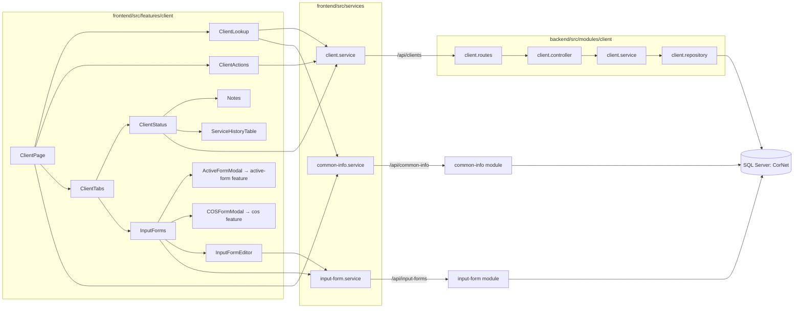

# 01 — Code Annotations

File-by-file annotation of the Client module. Line references are to the working tree on 2026-10-01. Database facts come from the `dbCDD` DDL (see [README](README.md#sources-and-confidence)).

---

## 1. Architecture overview

**Layering (backend):** `routes` (URL + Swagger) → `controller` (HTTP parsing, status codes) → `service` (pass-through today) → `repository` (parameterised T-SQL via `mssql`).

**State ownership (frontend):** `ClientPage` owns the single `client` object, `isLocked` and `isNewClient`. Children receive state and setters as props; `ClientLookup` exposes an imperative `clearLookup()` via `ref`.

---

## 2. Backend — `backend/src/modules/client`

### 2.1 [client.routes.ts](../../backend/src/modules/client/client.routes.ts)

Express `Router` mounted at `/api/clients` in [app.ts](../../backend/src/app.ts#L54). Each route carries a `@swagger` JSDoc block consumed by `swagger-jsdoc` and served at `/api-docs`.

| Order | Method | Path                     | Handler             |
| ----- | ------ | ------------------------ | ------------------- |
| 1     | GET    | `/`                      | `getAllClients`     |
| 2     | GET    | `/search/lastname`       | `searchLastName`    |
| 3     | GET    | `/search/firstname`      | `searchFirstName`   |
| 4     | GET    | `/search/ssn`            | `searchSSN`         |
| 5     | GET    | `/regions`               | `getAllRegions`     |
| 6     | GET    | `/:id`                   | `getClient`         |
| 7     | POST   | `/`                      | `createClient`      |
| 8     | PUT    | `/:id`                   | `updateClient`      |
| 9     | DELETE | `/:id`                   | `deleteClient`      |
| 10    | GET    | `/:id/status`            | `getClientStatus`   |
| 11    | GET    | `/:id/service-history`   | `getServiceHistory` |

> **Annotation:** the literal routes (`/search/*`, `/regions`) are declared **before** `/:id` so Express does not treat `"search"` / `"regions"` as an id. Keep this ordering when adding routes.
>
> **Annotation:** no `authenticate` middleware is applied (compare [dashboard.routes.ts](../../backend/src/routes/dashboard.routes.ts)).

### 2.2 [client.controller.ts](../../backend/src/modules/client/client.controller.ts)

Thin HTTP adapters. Express 5 forwards rejected promises to [error.middleware.ts](../../backend/src/middleware/error.middleware.ts), so there is no local `try/catch`.

| Function            | Input parsing                                                          | Response                                   |
| ------------------- | ---------------------------------------------------------------------- | ------------------------------------------ |
| `getAllClients`     | none                                                                   | `200` array of raw `stblPeople` rows        |
| `getClient`         | `Number(req.params.id)`                                                | `200` row, or `200` with empty body if not found |
| `createClient`      | `req.body` (camelCase `Client`)                                        | `201 { message: "Client created" }`        |
| `updateClient`      | `Number(req.params.id)`, `req.body`                                    | `200 { message: "Client updated" }`        |
| `deleteClient`      | `Number(req.params.id)`                                                | `200 { message: "Client deleted" }`        |
| `searchLastName`    | `String(req.query.search \|\| "")`                                     | `200` array                                |
| `searchFirstName`   | same                                                                   | `200` array                                |
| `searchSSN`         | same                                                                   | `200` array                                |
| `getClientStatus`   | validates id (→ `400 "Invalid ChildID"`); `date` defaults to today (UTC) | `200` status object                      |
| `getServiceHistory` | id; optional `date`                                                    | `200` array                                |
| `getAllRegions`     | none                                                                   | `200` array                                |

> **Annotation:** `createClient` / `updateClient` discard the row the repository returns ([client.controller.ts:9](../../backend/src/modules/client/client.controller.ts#L9), [:13](../../backend/src/modules/client/client.controller.ts#L13)). The frontend expects the saved client back — see [Business Rules BR-GAP-01](03-business-rules.md#known-gaps-and-defects).

### 2.3 [client.service.ts](../../backend/src/modules/client/client.service.ts)

Pure re-export of repository functions (`getClient` → `repo.getClientById`). Placeholder for future business logic (validation, auditing, authorisation).

### 2.4 [client.types.ts](../../backend/src/modules/client/client.types.ts)

`Client` interface — the **request** shape (camelCase). `region` is typed `string` here but `number` on the frontend; both are coerced in the repository. Audit fields (`insertDate`, `insertUser`, `lastUpdateDate`, `lastUpdateUser`) are declared but never sent by the frontend.

### 2.5 [client.repository.ts](../../backend/src/modules/client/client.repository.ts)

All SQL lives here. Every query uses `request.input(...)` parameters — no string concatenation of user input (the only interpolated fragment is the constant `dateFilter` in `getServiceHistory`).

| Function             | Tables                                                         | Notes |
| -------------------- | -------------------------------------------------------------- | ----- |
| `getAllClients`      | `stblPeople`                                                   | `SELECT *` ordered by `LastName, FirstName`. Unbounded. |
| `getClientById`      | `stblPeople`                                                   | Returns `recordset[0]` (may be `undefined`). |
| `createClient`       | `stblPeople`                                                   | Trims strings, blanks → `NULL`, `Gender` truncated to 1 char, `InsertUser` defaults to `SYSTEM`, `DOB` via `TRY_CONVERT(datetime2(0), @DOB, 23)` ([:142](../../backend/src/modules/client/client.repository.ts#L142)). `OUTPUT INSERTED.*` returns the new row. No required-field check. |
| `updateClient`       | `stblPeople`                                                   | Throws `400`-tagged error if `lastName`/`firstName` blank. Sets `LastUpdateDate = GETDATE()`. `DOB` via `CONVERT(date, @DOB, 23)` ([:225](../../backend/src/modules/client/client.repository.ts#L225)) — hard fails on bad input. Overwrites **every** column, including `Notes` → `NULL` if omitted ([:227](../../backend/src/modules/client/client.repository.ts#L227)). Binds `VarChar` for `nvarchar` columns and `VarChar(50)` for the `int` `Region` ([:188-191](../../backend/src/modules/client/client.repository.ts#L188-L191)) — see BR-GAP-09. Re-reads the row. |
| `deleteClient`       | `stblPeople`                                                   | Hard `DELETE`. The DB **cascades** to all 7 form tables, `stblServices`, `stblCOSCoverSource` and `stblCOSCoverTeam` (BR-DEL-02). |
| `searchLastName`     | `stblPeople`                                                   | `TOP 20`, `LastName LIKE 'x%'` (prefix). |
| `searchFirstName`    | `stblPeople`                                                   | `TOP 20`, `FirstName LIKE 'x%'` (prefix). |
| `searchSSN`          | `stblPeople`                                                   | `TOP 20`, `SS LIKE '%x%'` (contains) ([:299](../../backend/src/modules/client/client.repository.ts#L299)). |
| `getClientStatus`    | `stblPeople`, 7 × `stbl*Form`                                  | One SELECT of 7 scalar sub-queries — see [API §2.10](02-api.md#210-get-apiclientsidstatus). Differs from the legacy procedure `GetClientFormStats_rpt` (BR-GAP-21). |
| `getServiceHistory`  | `stblServiceGridForm` ⋈ **`Services`** (warehouse) ⟕ `slstServiceNames` | `Consent = 'Yes'` if `ConsentDate` not null else `'Pending'`; `CasePlan` always `NULL`. Reads the reporting-warehouse copy instead of the live `stblServices`. The legacy equivalent is `GetServiceHistory_rpt` (BR-GAP-20). |
| `getAllRegions`      | `stblReportingRegion`                                          | `Inactive = 0`, ordered by `RName`. Duplicate of `/api/common-info/regions`. |

---

## 3. Frontend — `frontend/src/features/client`

### 3.1 [pages/ClientPage.tsx](../../frontend/src/features/client/pages/ClientPage.tsx)

Container page.

| State          | Type              | Initial         | Purpose                                         |
| -------------- | ----------------- | --------------- | ----------------------------------------------- |
| `client`       | `Client`          | `emptyClient`   | The client currently displayed / edited         |
| `isNewClient`  | `boolean`         | `true`          | Set by actions; not read by any child today     |
| `isLocked`     | `boolean`         | `true`          | Read-only mode for demographic fields           |
| `regions`      | `RegionLookup[]`  | `[]`            | Loaded once from `/api/common-info/regions`; passed to `ClientTabs` → `InputForms` → `COSFormModal` |
| `clientLookupRef` | `Ref<ClientLookupRef>` | `null`  | Lets `ClientActions` clear the lookup dropdowns |

> **Annotation:** `emptyClient.region` is `0`, not `undefined`. On create, the backend converts `0` to the integer `0` and inserts it ([Business Rules BR-GAP-07](03-business-rules.md#known-gaps-and-defects)).

### 3.2 [components/ClientLookup/ClientLookup.tsx](../../frontend/src/features/client/components/ClientLookup/ClientLookup.tsx)

`forwardRef` component; two panels.

**Left panel — "Lookup Client"**

| Row        | Control              | Behaviour                                                                                             |
| ---------- | -------------------- | ----------------------------------------------------------------------------------------------------- |
| First Name | `SearchableSelect` + → | On `input-change`/`menu-close`, calls `searchFirstName(trim(value))`. Options: `value = childId`, `label = "First Last"`. → loads the client. |
| Last Name  | `SearchableSelect` + → | Same, via `searchLastName`.                                                                          |
| DOB        | `<input type=date>` + disabled → | **Bound directly to `client.dob`** and not disabled when locked ([:302-313](../../frontend/src/features/client/components/ClientLookup/ClientLookup.tsx#L302-L313)). The → button is permanently disabled — DOB lookup is not implemented. |
| SSN        | `SearchableSelect` + → | Via `searchSSN`. Option label is the SSN.                                                            |

**Right panel — Client details** (all disabled when `isLocked`): Client ID (read-only, shows `New` when no id), Last Name, Gender (`M`/`F` only; the DB also allows `U` = Unknown), First Name, SS# (`maxLength=10`; DB `nvarchar(15)`; FITP extract expects 9 digits), Region (`SearchableSelect` of active regions), Birth Date, computed Age, Non-EI checkbox.

| Function               | Annotation                                                                                     |
| ---------------------- | ---------------------------------------------------------------------------------------------- |
| `loadLookups`          | Loads regions on mount (duplicate of the call in `ClientPage`).                                |
| `mapClientToOption`    | `childId` → option value; `"first last"` → label.                                             |
| `handleFirstNameSearch` / `handleLastNameSearch` / `handleSSNSearch` | Empty input clears options; errors logged and options cleared. No debounce — one request per keystroke. |
| `calculateAge(dob)`    | Whole years, adjusted if the birthday has not occurred this year. `new Date('YYYY-MM-DD')` parses as UTC midnight ([:160](../../frontend/src/features/client/components/ClientLookup/ClientLookup.tsx#L160)), so on a US-timezone machine the age flips one day late. |
| `loadClient(childId)`  | `GET /api/clients/:id`, sets `client`, and syncs all three lookup selections to the loaded client. |
| `clearLookup()` (ref)  | Clears the three selections and option lists.                                                  |

### 3.3 [components/ClientActions/ClientActions.tsx](../../frontend/src/features/client/components/ClientActions/ClientActions.tsx)

Toolbar of four buttons.

| Button           | Enabled when                 | Action |
| ---------------- | ---------------------------- | ------ |
| Unlock / Lock    | always                       | Toggles `isLocked`. |
| Delete Client    | `client.childId && !isLocked`| `window.confirm` → `DELETE /api/clients/:id` → reset to `emptyClient`, `isNewClient = true`, lock. |
| Add New Client   | always                       | Reset to `emptyClient`, unlock, clear lookup. Does **not** save pending edits. |
| Done             | `!isLocked`                  | Client-side validates last/first name (toast). `PUT` if `childId`, else `POST`. On success: clear lookup, `setClient(response)`, `isNewClient = false`, lock. |

> **Annotation:** `setClient(savedClient)` stores whatever the API returned. Because the backend returns `{ message }`, `mapClient` produces a blank client — the form clears after every save. See BR-GAP-01.

### 3.4 [components/ClientTabs/ClientTabs.tsx](../../frontend/src/features/client/components/ClientTabs/ClientTabs.tsx)

Two tabs: **Client Status** (default) and **Input Forms**. Tab state is local; switching tabs unmounts the other tab, so its data reloads on return.

### 3.5 [components/ClientStatus/ClientStatus.tsx](../../frontend/src/features/client/components/ClientStatus/ClientStatus.tsx)

| State        | Purpose |
| ------------ | ------- |
| `statusDate` | "Client Status On" date, defaults to local today (`YYYY-MM-DD`). |
| `statusData` | Response of `GET /:id/status`. |
| `services`   | Response of `GET /:id/service-history`. |
| `loading`, `error` | UI flags. |

Effects: status reloads when `childId` **or** `statusDate` changes (so the Go button is effectively redundant); service history reloads when `childId` changes and is called **without** the status date ([:101](../../frontend/src/features/client/components/ClientStatus/ClientStatus.tsx#L101)).

`getStatusClass` colours `active` green and `inactive` red, but the backend returns raw `FormType` values (e.g. `aop`), so the colours rarely apply.

`formatDate` uses `toLocaleDateString('en-US')` on an ISO date string; the same UTC-vs-local shift as `calculateAge` applies.

### 3.6 [components/Notes/Notes.tsx](../../frontend/src/features/client/components/Notes/Notes.tsx)

Controlled `<textarea>` with `value`, `onChange`, `readOnly`. `ClientStatus` shows `client.notes`, reports edits through `onClientNotesChange` (which updates `client` in `ClientPage`), and makes it read-only while locked. **Done** saves the notes with the client (BR-GAP-10, fixed); there is no separate save.

### 3.7 [components/ServiceHistory/ServiceHistory.tsx](../../frontend/src/features/client/components/ServiceHistory/ServiceHistory.tsx) and [ServiceHistoryItem.tsx](../../frontend/src/features/client/components/ServiceHistory/ServiceHistoryItem.tsx)

Presentational table: Date, Service, Freq., Consent (badge: `Yes` green / `Pending` yellow / other red), Case Plan (badge: `Open` blue / other grey). The header "Freq. / Consent / Case Plan" links are placeholders with no handlers. `date` is rendered raw (ISO string).

### 3.8 [components/InputForm/InputForms.tsx](../../frontend/src/features/client/components/InputForm/InputForms.tsx)

Hosts the Input Forms tab for the selected client.

| Part              | Annotation |
| ----------------- | ---------- |
| History grid      | `GET /api/input-forms/history/:childId`. Columns: Date, Form Type, Referral, NOPR, Interim, OP, Exit, Loop Error, View/Edit, Delete. `loopError` is always `false` from the backend today. |
| `FormType`        | Displays `aop`, `aop-capta`, `active one plan`, `active one plan - capta` as **"Active"** (green); anything containing "service" in purple; else blue. |
| Show/Hide filter  | One checkbox per form type plus a check-all; filters the grid client-side only. |
| Add New Form      | One button per form type in `INPUT_FORM_OPTIONS`. `active` → `ActiveFormModal`, `cos-cover` → `COSFormModal`, everything else → generic `InputFormEditor`. |
| Delete            | `window.confirm` → `DELETE /api/input-forms/:form/:childId/:id` → reload. |
| `InputFormEditor` | Generic shell: Form Date (required), Form Type (free text), Region (free text). `InsertUser: 'SYSTEM'`. Banner states it is not production-ready. |

### 3.9 Shared types and services (outside the feature folder)

| File | Annotation |
| ---- | ---------- |
| [types/client.ts](../../frontend/src/types/client.ts) | Frontend `Client` (camelCase, `region: number`). |
| [services/client.service.ts](../../frontend/src/services/client.service.ts) | Axios wrapper for `/clients`. `mapClient` converts PascalCase DB rows to camelCase; trims `Gender`; cuts `DOB` to `YYYY-MM-DD`. `getStatus` / `getServiceHistory` return data unmapped (already camelCase). |
| [services/common-info.service.ts](../../frontend/src/services/common-info.service.ts) | `regions()` → `/common-info/regions`. |
| [services/input-form.service.ts](../../frontend/src/services/input-form.service.ts) | History + CRUD for `/input-forms/:form/:childId[/:id]`. |
| [types/input-form.ts](../../frontend/src/types/input-form.ts) | `InputFormName`, `InputFormHistoryItem`, `INPUT_FORM_OPTIONS`. |

### 3.10 Tests

Co-located `*.test.tsx` files exist for every component and the page (7 of them untracked in git as of this writing). They mock `client.service`, `common-info.service` and `input-form.service`.
