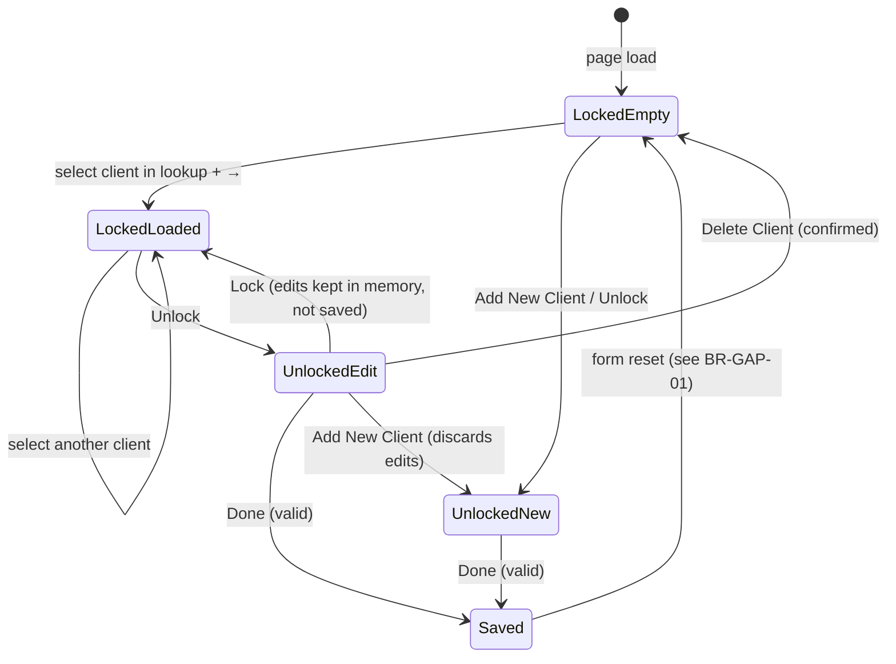

# 03 — Business Rules

Rules are written as **implemented** today, with the **legacy** rule (from the `dbCDD` stored procedures/views) alongside wherever the two differ. Each rule has an ID and the layer that enforces it: FE = frontend, BE = backend, DB = database constraint.

---

## 1. Client identity

| ID       | Rule | Enforced | Source |
| -------- | ---- | -------- | ------ |
| BR-ID-01 | A client is a row in `stblPeople`, identified by `ChildID` (`int IDENTITY(1,1)`, clustered PK). | DB | DDL |
| BR-ID-02 | A client with no `ChildID` is **new**; the UI shows `Client ID: New`. | FE | ClientLookup |
| BR-ID-03 | Display name is `FirstName LastName` in the lookup; legacy reports use `LastName, FirstName`. | FE | `mapClientToOption`; legacy `CName` |
| BR-ID-04 | Nothing prevents duplicate people. The legacy system relied on data-cleaning views (`DCFindDuplicateSSNs`, `FindDuplicatesInPeopleTable`) to find duplicate SSNs after the fact. | — | DDL views |

## 2. Required fields and validation

| ID        | Rule | Enforced | Source |
| --------- | ---- | -------- | ------ |
| BR-VAL-01 | Last Name is required (after trimming). Message: *"Last Name is required."* | FE (create + update); BE (update only); DB rejects `''` but **accepts NULL** | ClientActions; `updateClient`; `CHECK (len(LastName) > 0)` |
| BR-VAL-02 | First Name is required (after trimming). Message: *"First Name is required."* | Same as above | `CHECK (len(FirstName) > 0)` |
| BR-VAL-03 | Last Name is checked before First Name; only the first failure is shown. | FE | `saveClient` |
| BR-VAL-04 | Last Name and First Name are at most **50** characters. | DB | `nvarchar(50)` |
| BR-VAL-05 | Gender is `M` (Male), `F` (Female), `U` (Unknown) or NULL (no entry). The UI offers only M/F. The server keeps only the first character. | DB description; FE; BE | `MS_Description`; ClientLookup; repository |
| BR-VAL-06 | SSN: at most 15 characters in the DB. The FITP extract uses only the first 9 characters and assumes digits only. The UI allows 10. No format check anywhere. | DB, FE | `nvarchar(15)`; `Get_CIS_FITP_Output`; `maxLength={10}` |
| BR-VAL-07 | `SSTemp = 1` means the SSN is a **temporary** number; `0` (default) means a real SSN. | DB | `MS_Description`, default `0` |
| BR-VAL-08 | Date of birth is entered as a calendar date. On create an invalid date is stored as NULL; on update it causes an error. | FE, BE | `TRY_CONVERT` vs `CONVERT` |
| BR-VAL-09 | Region should be an **active** reporting region. Only the UI enforces this; the DB has no FK, so any integer (including `0`) is accepted. | FE | No FK `stblPeople.Region → stblReportingRegion.ID` |
| BR-VAL-10 | On create, strings are trimmed and empty strings become NULL. | BE | `createClient` |
| BR-VAL-11 | `NonEarlyIntervention`: `0` = Early Intervention (EI) client, `1` = non-EI client. Defaults to `0`. Drives the FITP extract (`'NOEI'` vs `'FITP'`, and the default exit date: DOB + 3 years for EI, last referral + 5 years for non-EI). | DB, legacy | `DF_stblPeople_EarlyIntegration`; `Get_CIS_FITP_Output` |

## 3. Lock / edit workflow

| ID         | Rule | Source |
| ---------- | ---- | ------ |
| BR-LCK-01 | The screen opens **locked**. | ClientPage `isLocked = true` |
| BR-LCK-02 | While locked, demographic inputs (Last/First Name, Gender, SS#, Region, Birth Date, Non-EI) are disabled. | ClientLookup |
| BR-LCK-03 | Done (save) and Delete are disabled while locked. | ClientActions |
| BR-LCK-04 | After a successful save or delete, the screen re-locks. | ClientActions |
| BR-LCK-05 | **Add New Client** clears the form, unlocks it, and clears the lookup. It does **not** save or warn about unsaved changes. | `addNewClient` |
| BR-LCK-06 | **Lock** does not revert unsaved edits; they stay on screen until another client is loaded. | `toggleLock` |
| BR-LCK-07 | Save: if `ChildID` exists → update; otherwise → create. | `saveClient` |
| BR-LCK-08 | Delete requires a loaded client, an unlocked screen and the confirmation *"Are you sure you want to delete this client?"*. | `deleteClient` |
| BR-LCK-09 | Toasts: *"Client created successfully"*, *"Client updated successfully"*, *"Client deleted successfully."*; on failure *"Failed to save client."* / *"Failed to delete client."* | ClientActions |
| BR-LCK-10 | No optimistic-concurrency check: if two users edit the same client, the last save wins. `stblPeople.SSMA_TimeStamp` (`rowversion`) is available for this but is not used. | DDL; `updateClient` |

## 4. Client lookup

| ID         | Rule | Source |
| ---------- | ---- | ------ |
| BR-LKP-01 | First Name and Last Name search are **starts-with** matches. | `LIKE 'x%'` |
| BR-LKP-02 | SSN search is a **contains** match. | `LIKE '%x%'` |
| BR-LKP-03 | Each search returns at most **20** clients. Name searches sort by the searched name, then the other name; SSN sorts by Last, First. | repository |
| BR-LKP-04 | Leading/trailing spaces are ignored; an empty search clears the list without calling the API. | ClientLookup |
| BR-LKP-05 | Case sensitivity follows the database collation (not in the script; SQL Server default is case-insensitive — confirm). | DB |
| BR-LKP-06 | A client loads only when the user picks a match **and** presses →. | ClientLookup |
| BR-LKP-07 | Loading a client fills all three lookup boxes with that client. | `loadClient` |
| BR-LKP-08 | DOB lookup is not available (→ permanently disabled). | ClientLookup |

## 5. Client status (Status tab)

### 5.1 Current implementation

| ID         | Rule | Source |
| ---------- | ---- | ------ |
| BR-DER-01 | **Age** = whole years between DOB and today, minus 1 if this year's birthday hasn't happened yet. No DOB → `--`. | `calculateAge` |
| BR-DER-02 | **Status as of D** = raw `FormType` of the most recent form (any of the 7 form tables) with `FormDate ≤ D`. | `getClientStatus` |
| BR-DER-03 | **Referral Date** = `MAX(stblActiveForm.ReferralDate) ≤ D`. | same |
| BR-DER-04 | **No One Plan Date** = `MAX(stblNoOnePlanForm.StatusDate) ≤ D`. | same |
| BR-DER-05 | **Interim Date** = `MAX(stblActiveForm.InterimDate) ≤ D`. | same |
| BR-DER-06 | **One Plan Date** = `MAX(stblCOSCoverForm.OnePlanDate) ≤ D`. | same |
| BR-DER-07 | **Exit Date** = `MAX(stblExitForm.ExitDate) ≤ D`. | same |
| BR-DER-08 | "Client Status On" defaults to today; changing it reloads immediately. **Today** resets it. | ClientStatus |

### 5.2 Legacy rule (`GetClientFormStats_rpt`, parameters `@txtChildID`, `@txtStatusDate`)

The legacy screen took the **latest form on or before D** from each of **four** key forms only, filtering on `FormDate`:

| Output | Legacy source (each: latest row with `FormDate ≤ D`) |
| ------ | ---------------------------------------------------- |
| Status | The most recent of those four forms, labelled by which table it came from: Referral → **"Referred In Process"**, Active → **"Active"**, Exit → **"Exited"**, No One Plan → **"No One Plan Resulting"** |
| Referral Date | `stblReferralForm`: `ReReferralDate` if set, else `ReferralDate` |
| Interim Date | `stblActiveForm.InterimDate` — blank if earlier than Referral Date |
| One Plan Date | `stblActiveForm.InitialMeetingDate` ("Date of initial meeting to develop the initial One Plan") — blank if earlier than Referral Date |
| Exit Date | `stblExitForm.ExitDate` — intended to be blank if earlier than Referral Date |
| No One Plan Date | `stblNoOnePlanForm.StatusDate` — intended to be blank if earlier than Referral Date |

Rules derived from it:

| ID         | Rule |
| ---------- | ---- |
| BR-STS-01 | Only Referral, Active, Exit and No One Plan forms determine status. COS, Insurance and Service Grid forms do **not** change status. |
| BR-STS-02 | Status labels are business terms, not form codes: *Referred In Process*, *Active*, *Exited*, *No One Plan Resulting*. |
| BR-STS-03 | Milestone dates belong to the **current referral episode**: dates earlier than the current referral date are blanked, because they came from a previous episode. |
| BR-STS-04 | "As of D" is decided by each form's `FormDate`, not by the milestone date itself. |

> The SQL Server port of this procedure has bugs of its own: `TOP 1` without `ORDER BY` (the `ORDER BY FormDate DESC` was commented out), and the Exit/NOPR `CASE` expressions have no `ELSE`, so they always return NULL. Treat the **intent** above as the rule, not the procedure's literal output.

### 5.3 Service history

| ID         | Current rule | Legacy rule (`GetServiceHistory_rpt`) |
| ---------- | ------------ | ------------------------------------- |
| BR-SVC-01 | Source: `stblServiceGridForm` ⋈ **`Services`** (warehouse copy) ⟕ `slstServiceNames` | Source: `stblServiceGridForm` ⋈ **`stblServices`** ⋈ `slstServiceNames` |
| BR-SVC-02 | All services for the client | Excludes `OutcomeStatus = 3` (*Outcome Cont.*) |
| BR-SVC-03 | No date filter from the UI | `stblServiceGridForm.ConsentDate ≤ status date` |
| BR-SVC-04 | Date shown = Service Grid `FormDate` | Date shown depends on `OutcomeStatus`: 1 *New Outcome* → `ActualStartDate`; 2 *New Frequency* → grid `ConsentDate`; 4 *Service Ended* → `EndDate` |
| BR-SVC-05 | Consent = `Yes` if `Services.ConsentDate` is set, else `Pending` | Consent date = `stblServiceGridForm.ConsentDate` ("Date of Signed Consent"). The procedure notes that service-level `ConsentDate` is always NULL |
| BR-SVC-06 | Frequency = `Services.Frequency` | Legacy returns `HowLong` (no Frequency column exists in `stblServices`) |
| BR-SVC-07 | Sort: newest form first | Sort: `slstServiceNames.SortOrder`, then `ConsentDate` (keeps Service Coordination at the top) |

## 6. Input Forms tab

| ID        | Rule | Source |
| --------- | ---- | ------ |
| BR-IF-01 | Forms are available only after a client is selected (*"Select a client to view input forms."*). | InputForms |
| BR-IF-02 | Form types: Active, COS, Exit, Insurance, No One Plan, Referral, Service Grid. The DB default `FormType` of each table is exactly these labels (`nvarchar(12)`). | `INPUT_FORM_OPTIONS`; DDL defaults |
| BR-IF-03 | History lists all forms for the client, newest `FormDate` first. Legacy tie-break: `slstFormNames.Sort DESC`, then form ID. | `getHistory`; `sqryFormList` |
| BR-IF-04 | `aop`, `aop-capta`, `Active One Plan`, `Active One Plan - CAPTA` display as **Active**. (The last two are longer than 12 characters, so they can't be stored.) | `FormType` component |
| BR-IF-05 | Users can show/hide form types in the grid; all are shown by default. Display only. | InputForms |
| BR-IF-06 | Deleting a form asks *"Delete {type} dated {m/d/yyyy}?"*. | `handleDelete` |
| BR-IF-07 | Generic forms require a Form Date. | `InputFormEditor` |
| BR-IF-08 | Active and COS forms open their dedicated editors. | InputForms |
| BR-IF-09 | `FormDate` meaning differs by form: Referral/Active/Exit/NOPR → last day of the reporting month (from `MonthReporting`); COS → `OnePlanDate` for entry, `ExitDate` for exit; Insurance → date completed; Service Grid → creation date. | `MS_Description` |

### 6.1 History grid columns — legacy definition (`sqryFormListA`)

| Column | Legacy value per form |
| ------ | --------------------- |
| Referral | Referral form: `FormDate`. Others: blank |
| NOPR | No One Plan form: `StatusDate`. Others: blank |
| Interim | Active form: `InterimDate`. Others: blank |
| OP | Active form: `InitialMeetingDate`. Others: blank |
| Exit | Exit form: `ExitDate`. Others: blank |

### 6.2 Loop errors (legacy `sqryFormListComplete` → `stblLoopErrors`)

A "loop" is one referral-to-exit episode. A form is flagged as a **loop error** when it appears out of sequence. For each form, the **previous key form** is the form on the same date with a lower `slstFormNames.Sort`; if there is none, it is the latest form on an earlier date. Insurance, Service Grid and COS forms are never used as the previous key form.

| ID        | The form is a loop error when… |
| --------- | ------------------------------ |
| BR-LOOP-01 | a **Referral** follows a Referral or an Active form (a new referral while one is already open or active) |
| BR-LOOP-02 | a **No One Plan** form does not follow a Referral |
| BR-LOOP-03 | an **Active** form does not follow a Referral |
| BR-LOOP-04 | an **Exit** form does not follow an Active form |
| BR-LOOP-05 | a **Service Grid** form does not follow an Active form |
| BR-LOOP-06 | a No One Plan, Active, Exit or Service Grid form has no previous key form at all |
| BR-LOOP-07 | `FormDate` is NULL |

A child with any loop error is written to `stblLoopErrors` (`ChildID` PK, `CName`, `QDate`). The rewrite returns `loopError = false` for every row (BR-GAP-22).

## 7. Audit

| ID         | Rule | Source |
| ---------- | ---- | ------ |
| BR-AUD-01 | `InsertDate`/`LastUpdateDate` default to `GETDATE()`; `InsertUser`/`LastUpdateUser` default to `SUSER_SNAME()` (the SQL login). All four are `NOT NULL`. | DDL defaults |
| BR-AUD-02 | The rewrite sends `InsertUser = 'SYSTEM'`, which overrides the DB default. On update it sets `LastUpdateDate = GETDATE()` and `LastUpdateUser = 'SYSTEM'`. | repository |
| BR-AUD-03 | The legacy DB has a `stblAudit` table (`ChildID`, `SS`, `User`, `Timestamp`, `Comment`). It is not written by the rewrite. Confirm whether SSN/identity changes must still be audited there. | DDL |

## 8. Delete

| ID         | Rule | Source |
| ---------- | ---- | ------ |
| BR-DEL-01 | Deleting a client is a **hard delete** of the `stblPeople` row. | `deleteClient` |
| BR-DEL-02 | The DB **cascades** the delete to all 7 form tables, and from there to `stblCOSCoverSource`, `stblCOSCoverTeam` and `stblServices`. A client's entire history is removed in one statement. | FKs `ON DELETE CASCADE` |
| BR-DEL-03 | Rows keyed by `ChildID` without an FK are **orphaned**: `Loops`, `Services`, `stblAudit`, `stblLoopErrors`, `InitialExistingDiagnosticTable`, `ManytoManyDiagnostics`. | DDL |
| BR-DEL-04 | The FKs were created `WITH NOCHECK` and then enabled. They apply to new changes, but SQL Server marks them untrusted and existing orphans were never validated. | DDL |

## 9. Security and privacy

| ID         | Rule / observation | Source |
| ---------- | ------------------ | ------ |
| BR-SEC-01 | `/api/clients/*` has **no authentication middleware**. Any caller that can reach the API can read, search, create, update and delete clients (and, via cascade, all their forms), including SSNs. | [client.routes.ts](../../backend/src/modules/client/client.routes.ts) vs [dashboard.routes.ts](../../backend/src/routes/dashboard.routes.ts) |
| BR-SEC-02 | SSNs are returned in full by `GET /`, `GET /:id` and `/search/ssn`; no masking. | repository |
| BR-SEC-03 | All SQL is parameterised. | repository |
| BR-SEC-04 | `createClient` / `updateClient` `console.log` the full request body (including SSN) to server logs. | repository |

---

## Known gaps and defects

Severity is a suggestion for triage. Items marked **(DDL)** were found or re-rated after reviewing the database script.

| ID         | Severity | Description | Where |
| ---------- | -------- | ----------- | ----- |
| BR-GAP-01 | **High** | Create/Update return `{ message }`, but the frontend treats the response as the saved client. After every save the form goes blank; after a create the user never sees the new `ChildID`. | [client.controller.ts:9](../../backend/src/modules/client/client.controller.ts#L9), [:13](../../backend/src/modules/client/client.controller.ts#L13); ClientActions |
| BR-GAP-02 | **High** | No authentication on client routes. Combined with BR-DEL-02, an unauthenticated `DELETE` wipes a child's entire record set. | client.routes.ts |
| BR-GAP-03 | **High** | The lookup-panel DOB field edits the loaded client's DOB even while locked. | [ClientLookup.tsx:302-313](../../frontend/src/features/client/components/ClientLookup/ClientLookup.tsx#L302-L313) |
| BR-GAP-20 | **High (DDL)** | Service history reads the warehouse table **`Services`** (no FK, populated by the reporting process, `ID` nullable), not the live table **`stblServices`**. Services entered through the new app are not in it, so history is stale or empty. `Frequency` and service-level `ConsentDate` exist only in the warehouse table. | `getServiceHistory` |
| BR-GAP-21 | **High (DDL)** | Status logic differs from legacy (§5.2): 7 forms instead of 4; raw `FormType` instead of status labels; Referral Date from the Active form instead of the Referral form; One Plan Date from COS `OnePlanDate` instead of Active `InitialMeetingDate`; filters on milestone dates instead of `FormDate`; previous-episode dates not blanked. | `getClientStatus` |
| BR-GAP-10 | ✅ **Fixed** | ~~Notes on the Client Status tab are editable but never saved.~~ Notes now edit `client.notes` and are saved **only by Done**, together with the rest of the client (`PUT /:id` for an existing client, `POST /` for a new one). There is no separate Save Notes action. Notes are editable only while unlocked. | ClientStatus / Notes |
| BR-GAP-05 | **Medium → High (DDL)** | Create has no server-side name check, and blanks become NULL. The DB `CHECK (len(x) > 0)` lets NULL through, so a client with no name can be saved. | `createClient` |
| BR-GAP-23 | **Medium (DDL)** | The new Active form saves `FormType = 'aop' / 'aop-capta'`; the DB default and `slstFormNames` use `'Active'`. Legacy objects that `INNER JOIN slstFormNames ON FormType = FormName` (`sqryFormList`, `sqryFormListTemp`, `sqryKeyFormsMaxType`, point-in-time and Indicator 3 reports, loop-error logic) **silently drop** these forms. | [GeneralInformation.tsx:65](../../frontend/src/features/active-form/components/GeneralInformation.tsx#L65) |
| BR-GAP-22 | Medium (DDL) | Input Forms history differs from legacy `sqryFormListA` (§6.1): Active rows show `ReferralDate` instead of blank; NOPR uses `FormDate` instead of `StatusDate`; OP comes from COS `OnePlanDate` instead of Active `InitialMeetingDate`; Exit also shows COS `ExitDate`; loop error is always false instead of applying §6.2. | `input-form.history.repository.ts` |
| BR-GAP-04 | Medium | SS# `maxLength=10` matches neither format: a 9-digit SSN fits, but a dashed one (11 characters) doesn't. The FITP extract needs 9 digits (README Q3). | [ClientLookup.tsx:472](../../frontend/src/features/client/components/ClientLookup/ClientLookup.tsx#L472) |
| BR-GAP-06 | Medium | Errors tagged `status: 400` are returned as `500`. | error.middleware.ts |
| BR-GAP-07 | Medium | New clients default to `region: 0`. With no FK, `0` is stored. Legacy reports that `INNER JOIN stblReportingRegion` (e.g. `DCMissingEthnicity`, `DCRecordsWithNoReferrals`) then skip the child. | `emptyClient` |
| BR-GAP-08 | Medium | Update overwrites every column; any field omitted from the body becomes NULL/0 (e.g. `Notes`). | `updateClient` |
| BR-GAP-09 | Medium (DDL) | Create and update bind columns differently. **Update binds `VarChar`** for `nvarchar` columns (`LastName`, `FirstName`, `SS`, `Gender`, `Notes`), so non-Latin characters are lost. Names bound as `VarChar(100)` against `nvarchar(50)` fail with a truncation error (500) above 50 characters. `Notes` is now bound as `NVarChar(MAX)` in create and update (fixed). `Region` is bound as `VarChar(50)` but the column is `int`. | `updateClient` |
| BR-GAP-11 | Medium | Dates are parsed as UTC midnight and shown in local time, so they can display a day early in US time zones. | `calculateAge`, ClientStatus `formatDate` |
| BR-GAP-24 | Low (DDL) | Gender `U` (Unknown) is valid in the DB but missing from the UI dropdown. A client with `U` shows "Select", and re-saving keeps `U` only if the user doesn't touch the field. | ClientLookup |
| BR-GAP-12 | Low | Service history ignores the "Client Status On" date. | [ClientStatus.tsx:101](../../frontend/src/features/client/components/ClientStatus/ClientStatus.tsx#L101) |
| BR-GAP-13 | Low | Status colouring expects `active`/`inactive`; neither the current output nor the legacy labels use `inactive`. | `getStatusClass` |
| BR-GAP-14 | Low | Status tie-break compares record IDs across different tables. Legacy used `slstFormNames.Sort`. | `getClientStatus` |
| BR-GAP-15 | Low | `GET /:id` returns `200` with an empty body for unknown IDs; `PUT`/`DELETE` succeed on unknown IDs. | controller |
| BR-GAP-16 | Low | Lookup searches fire on every keystroke. There are **no indexes** on `LastName`, `FirstName`, `SS` (only the PK), so every keystroke scans `stblPeople`. | ClientLookup; DDL |
| BR-GAP-17 | Low | ✅ **Duplicates fixed:** regions are loaded once by `ClientPage` (passed to `ClientLookup`), and `/api/clients/regions` was removed in favour of `/api/common-info/regions`. Still open: `WHERE Inactive = 0` hides regions where `Inactive` is NULL (the column is nullable). | common-info |
| BR-GAP-18 | Low | `isNewClient` is maintained but never read. | ClientPage / ClientActions |
| BR-GAP-19 | Low | `%` or `_` typed in the search boxes act as SQL wildcards. | repository |
| BR-GAP-25 | Low (DDL) | `slstServiceNames.SvcCode` is not unique (PK is `SvcNameID`). If a code repeats, the service-history join returns duplicate rows. | `getServiceHistory` |
