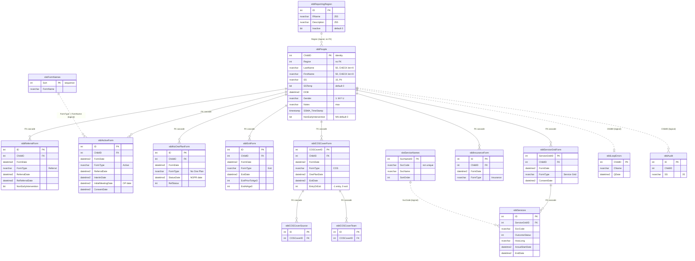
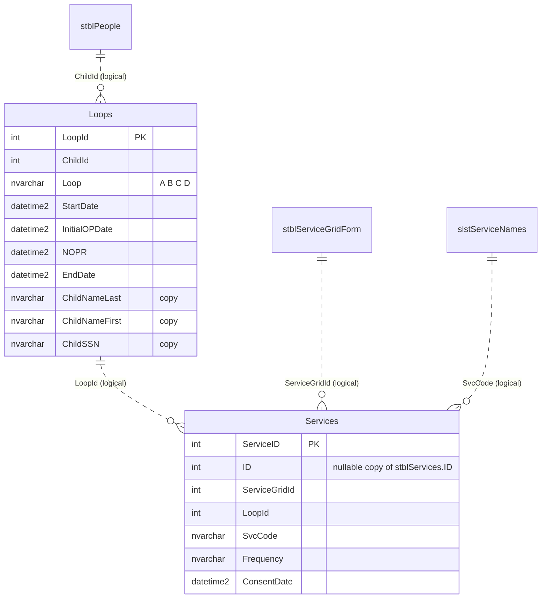
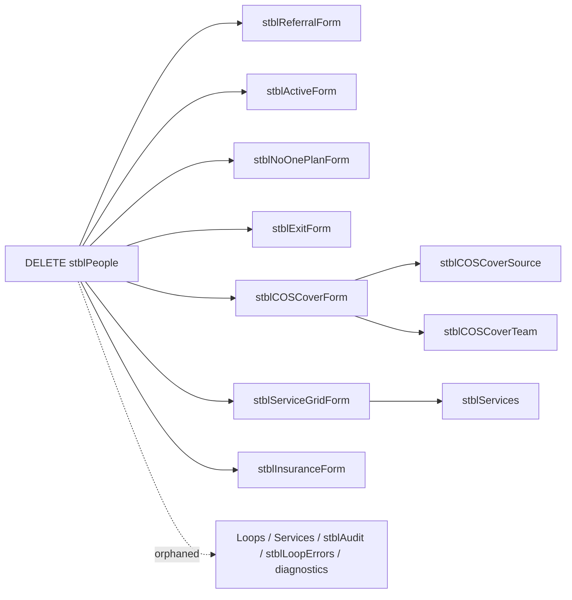

# 07 — Entity-Relationship Diagram

Built from the `dbCDD` DDL (2026-09-09). Solid relationship lines are **physical FKs** (all `ON UPDATE CASCADE ON DELETE CASCADE`, created `WITH NOCHECK`). Relationships marked *logical* exist only in queries; the DB doesn't enforce them.

Form tables show only the columns this module uses.

---

## 1. Client module ERD

## 2. Warehouse tables touched by the rewrite

The current service-history query reads `Services`, which belongs to the reporting warehouse, not to the operational schema (BR-GAP-20).

## 3. Relationship catalogue

| # | Parent (1) | Child (many) | Join | Physical FK | On delete | Used in |
| - | ---------- | ------------ | ---- | ----------- | --------- | ------- |
| R1 | `stblReportingRegion` | `stblPeople` | `Region = ID` | **No** | — | Region dropdown |
| R2 | `stblPeople` | `stblReferralForm` | `ChildID` | `stblReferralForm$stblPeoplestblReferralForm` | Cascade | Status, history |
| R3 | `stblPeople` | `stblActiveForm` | `ChildID` | `stblActiveForm$stblPeoplestblActiveForm` | Cascade | Status, history |
| R4 | `stblPeople` | `stblNoOnePlanForm` | `ChildID` | `stblNoOnePlanForm$stblPeoplestblNoOnePlanForm` | Cascade | Status, history |
| R5 | `stblPeople` | `stblExitForm` | `ChildID` | `stblExitForm$stblPeoplestblExitForm` | Cascade | Status, history |
| R6 | `stblPeople` | `stblCOSCoverForm` | `ChildID` | `stblCOSCoverForm$stblPeoplestblCOSCoverForm` | Cascade | Status, history |
| R7 | `stblPeople` | `stblServiceGridForm` | `ChildID` | `stblServiceGridForm$stblPeoplestblServiceGridForm` | Cascade | Status, history, services |
| R8 | `stblPeople` | `stblInsuranceForm` | `ChildID` | `stblInsuranceForm$stblPeoplestblInsuranceForm` | Cascade | Status, history |
| R9 | `stblServiceGridForm` | `stblServices` | `ServiceGridID` | `stblServices$stblServiceGridFormstblServices` | Cascade | Legacy service history |
| R10 | `stblCOSCoverForm` | `stblCOSCoverSource` / `stblCOSCoverTeam` | `COSCoverID` | Yes (2) | Cascade | COS feature |
| R11 | `slstServiceNames` | `stblServices` / `Services` | `SvcCode` | **No** (and `SvcCode` not unique) | — | Service history |
| R12 | `stblPeople` | `stblLoopErrors`, `stblAudit`, `Loops`, diagnostics | `ChildID` | **No** | Orphaned on delete | Legacy reports |
| R13 | `slstFormNames` | all form tables | `FormType = FormName` | **No** (text match) | — | Legacy form ordering, loop errors |

### Cascade path when a client is deleted

## 4. Notes for the DBA

1. Every FK was created `WITH NOCHECK`, so SQL Server marks it **untrusted** (`is_not_trusted = 1`). Run `ALTER TABLE … WITH CHECK CHECK CONSTRAINT …` after cleaning orphans, so the optimiser can rely on them.
2. No non-clustered indexes exist on `stblPeople(LastName)`, `(FirstName)`, `(SS)`, or on `ChildID` in any form table. The FK columns are unindexed too, which also makes the cascade delete scan each child table.
3. `stblPeople.Region` has no FK to `stblReportingRegion`; check for orphans (including `0`) before adding one.
